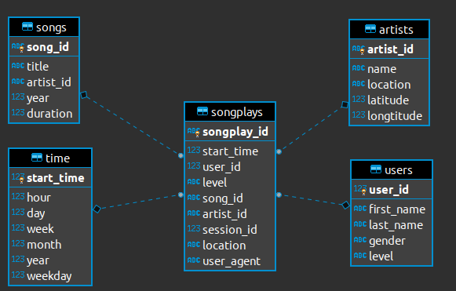

# Sparkify's song-play ETL pipeline

## The nature of a need for the song-play ETL pipeline
Sparkify finds it extremely important to keep the customers 
engaged with and stay active on our platform by continuously 
updating the application with new features tailored to the users' needs 
by analyzing their listening activities on Sparkify.   

We believe that based on the current song list that each user is listening to, 
we will be able to find patterns that allow us to understand 
their preferences and recommend them with new and related songs, as well 
as provide meaningful data to our other analysis tools.   

Our existing process involves the creation of a dataset provided as JSON files and 
including our whole song libraries and log data from all of our users' current playing songs
on our Sparkify streaming application.   

The project provides an ETL pipeline to easily parse the data from these files 
and save them into Postgres for further analysis.

## ETL pipeline designs

As we focus on the current playing song from each user, 
we find that STAR schema with fact and dimension tables are 
the most effective way for our ETL needs.   

The current playing songs are considered our fact data, 
while supporting data including info about our users, the artists who perform those songs, 
the songs' details, and the time when each song is played are also important and 
used as dimension tables.   

Here is the detailed diagram of our fact and dimension tables and their relationship:

## ELT pipeline Step-by-step instructions
From the workspace directory, run `create_tables.py` script to create the database and tables.
```shell
$ python create_tables.py
```
The `etl.py` script provides the main ETL process for our data pipeline. 
It first loads the data from the `data` directory, 
then extracts the required data and inserts them into the tables 
using the queries from `sql_queries.py`.
```shell
$ python etl.py
```
To get more details about what the ETL process does behind the scene, 
refer to `etl.ipynb` notebook. 
## Example queries
We find that building queries to run against these fact and dimension tables 
are vital to our analysis. Here are some sample queries you can use to get the initial grasp 
of what the data can help you with.
1. Specify the list of playing songs for an user. 
    ```sql
    select u.first_name ,u.last_name, s.title from songplays sp
    join users u
    on sp.user_id = u.user_id
    join songs s
    on sp.song_id = s.song_id ;
    ```
2. Look for how popular each song is based on its occurrences in the current song playing list for all users.
    ```sql
    select s.title, count(sp.song_id ) as occurrences  from songplays sp
    join songs s 
    on sp.song_id = s.song_id
    group by s.title 
    order by occurrences;
    ```
## About the Sparkify the company
Sparkify is a company focusing on providing our music lovers with our large collection of songs 
from all genres and countries around the world. Our streaming application, Sparkify, 
is highly reviewed by our loyal customers with its easy-to-use and intelligent features. 